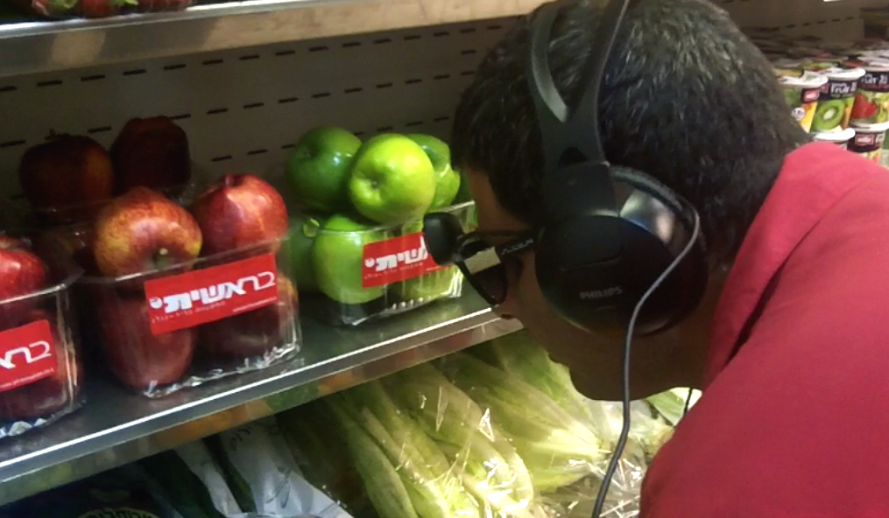

# Bartimeo
Herramientas que pueden ayudar a una persona ciega  

## Links relacionados
* [Text Detection with OpenCV in Python](https://www.youtube.com/watch?v=6DjFscX4I_c)
* [COCO-Text: Dataset for Text Detection and Recognition](https://vision.cornell.edu/se3/coco-text-2/)
* [Learninng to Read: Computer Vision Methods for Extracting Text from Images](https://www.capitalone.com/tech/machine-learning/learning-to-read-computer-vision-methods-for-extracting-text-from-images/)
* [ICDAR 2019 Robust Reading competitions](https://rrc.cvc.uab.es/)
* [Detectron2](https://colab.research.google.com/drive/16jcaJoc6bCFAQ96jDe2HwtXj7BMD_-m5)
