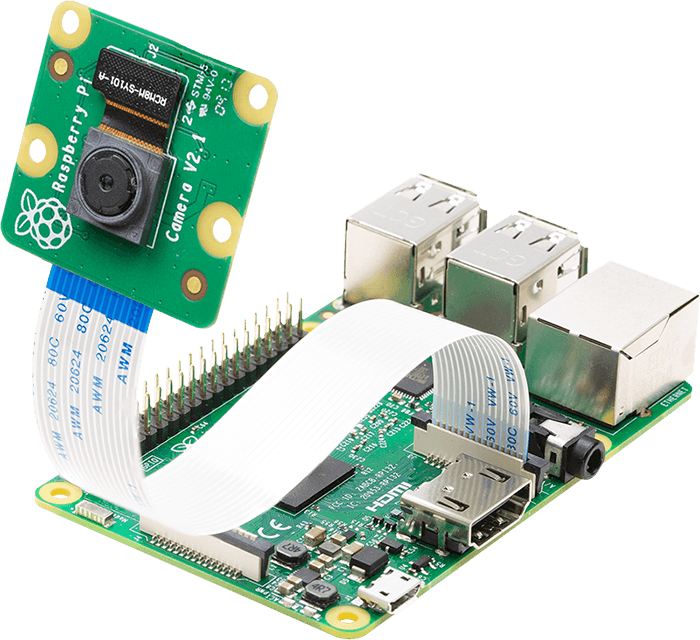

# Bartimeo
Herramientas de apoyo en visión artificial    
  
## Posibles skills 
1. Leer libros: Detectar texto por medio de una cámara y escucharlo.
2. Traducir textos a otros idiomas
3. Diferenciar billetes
	1. Valor del billete
	2. Detectar si es falso o verdadero
4. Reconocer personas conocidas
## Posible ubicación de la cámara   

## Hardware
1. Componentes
	1. [1 Raspberry Pi](https://www.raspberrypi.org/products/raspberry-pi-2-model-b/ "Dale click para que veas el producto")   
		   
	2. [1 Picamera](https://www.raspberrypi.org/products/camera-module-v2/ "Dale click para que veas el producto")   
		   
	3. 1 pulsador    
		   
	4. 1 resistor 330 ohm (1/4 W)   
		   
2. Conexiones  
	1. Conectamos la picamera a la Raspberry Pi   
		   
	2. Conectamos un pulsador en el gpio27   
		   
3. Habilitar la picamera
	```
	$ sudo raspi-config
	```
	  
	  
	  
	  
	  
	  
## Links relacionados
* [Text Detection with OpenCV in Python](https://www.youtube.com/watch?v=6DjFscX4I_c)
* [COCO-Text: Dataset for Text Detection and Recognition](https://vision.cornell.edu/se3/coco-text-2/)
* [Learninng to Read: Computer Vision Methods for Extracting Text from Images](https://www.capitalone.com/tech/machine-learning/learning-to-read-computer-vision-methods-for-extracting-text-from-images/)
* [ICDAR 2019 Robust Reading competitions](https://rrc.cvc.uab.es/)
* [Detectron2](https://colab.research.google.com/drive/16jcaJoc6bCFAQ96jDe2HwtXj7BMD_-m5)
* [Google Lookout-Android App For The Visually Impaired-The Blind Life](https://www.youtube.com/watch?v=l33FeITNCsw)
* [Smart Glasses for visually impaired people](https://www.youtube.com/watch?v=oWvlYXsNRqM)
* [LENTES DE LECTURA PARA PERSONAS CON BAJA O NULA CAPACIDAD VISUAL](https://ocapunay.blogspot.com/?view=classic)
