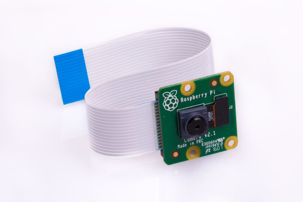
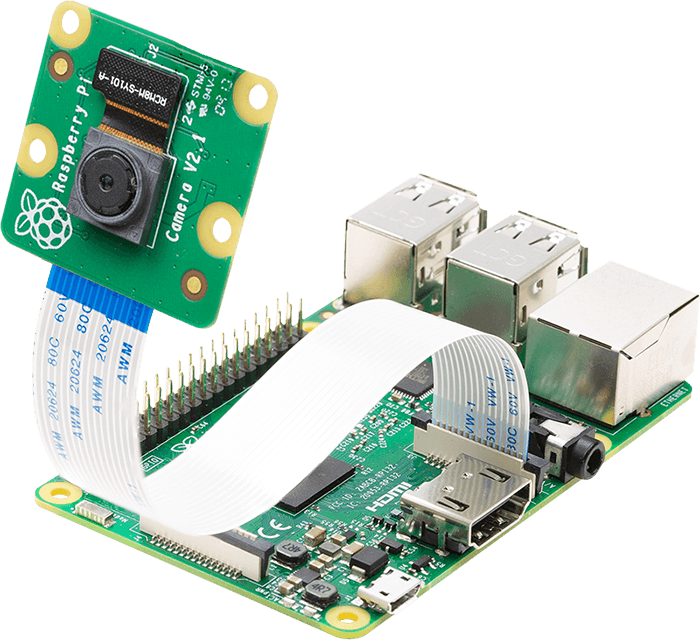
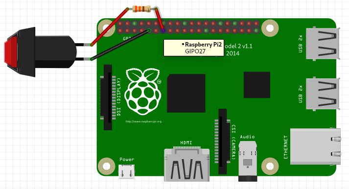
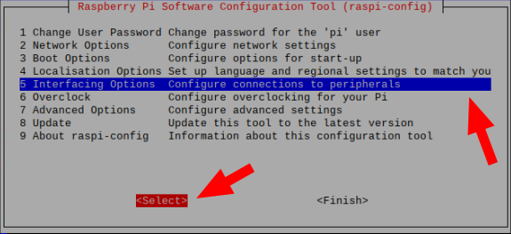
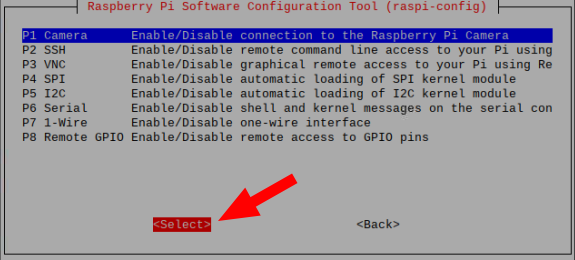
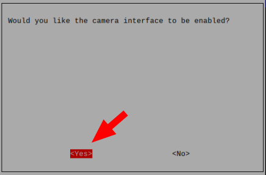
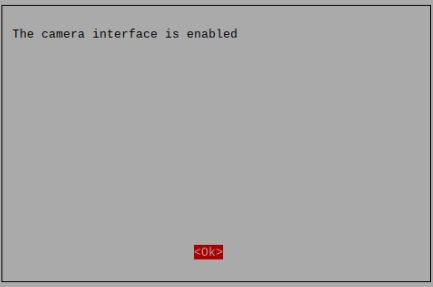
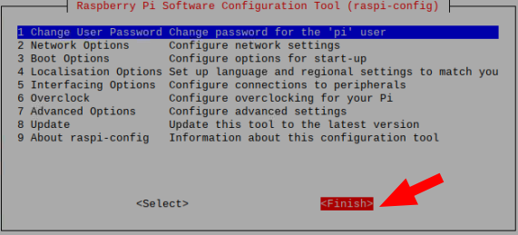
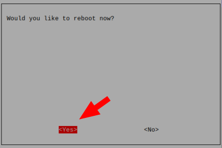
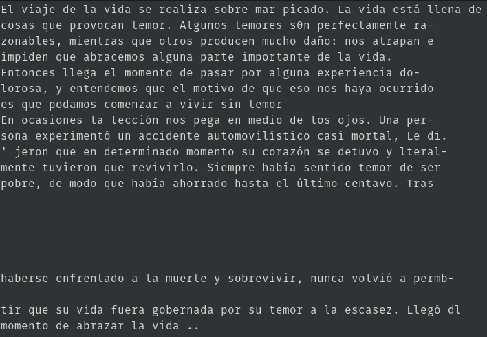

# Leer libro: Detectar texto de un libro y escucharlo
1. Hardware
	1. Componentes
		1. [1 Raspberry Pi](https://www.raspberrypi.org/products/raspberry-pi-2-model-b/ "Dale click para que veas el producto")   
			   
		2. [1 Picamera](https://www.raspberrypi.org/products/camera-module-v2/ "Dale click para que veas el producto")   
			   
		3. 1 pulsador    
			   
		4. 1 resistor 330 ohm (1/4 W)   
			   
	2. Conexiones  
		1. Conectamos la picamera a la Raspberry Pi   
			   
		2. Conectamos un pulsador en el gpio27   
			   
2. Instalación en la Raspberry Pi
	1. Habilitar la picamera
		```
		$ sudo raspi-config
		```
		  
		  
		  
		  
		  
		  
	1. tesseract-ocr
		```
		$ sudo apt install tesseract-ocr
		$ tesseract -v
		```
	2. idiomas para tesseract-ocr
		1. español
			1. idioma
				```
				$ sudo apt install tesseract-ocr-spa
				```
			2. diccionario
				```
				$ sudo apt install hunspell-es
				```
		2. japones
			1. idioma
				```
				$ sudo apt install tesseract-ocr-jpn
				```
	3. gTTS
		```
		$ sudo pip3 install gTTS
		```
	4. mplayer
		```
		$ sudo apt install mplayer
		```
3. Script para usar el gpio27
	1. Contenido del script: `bartimeo.sh`
		```
		#!/bin/bash
		i=0
		while true; do
			if [ $(gpio read 2) == 0 ]; then
				raspistill -o $i.jpg
				tesseract $i.jpg texto$i -l spa
				gtts-cli -l 'es' -f texto$i.txt -o $i.mp3
				i=$((i+1))
				echo listo papi
			fi
		done
		```
	2. Le damos permiso de ejecución
		```
		$ chmod +x bartimeo.sh
		```
	3. Ejecutamos
		```
		$ ./bartimeo.sh
		```
4. Como usarlo
	1. Enfocamos la cámara sobre el texto del libro  
		
	2. Presionamos el pulsador   
	3. De la imagen podremos extraer el texto en un archivo .txt   
		
	4. Se generará un archivo .mp3 y se ejecutará, por tanto podremos escucharlo   
		[Click para escuchar el audio](test/4.mp3)
