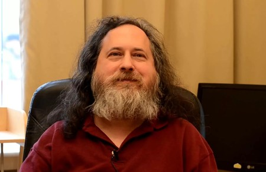
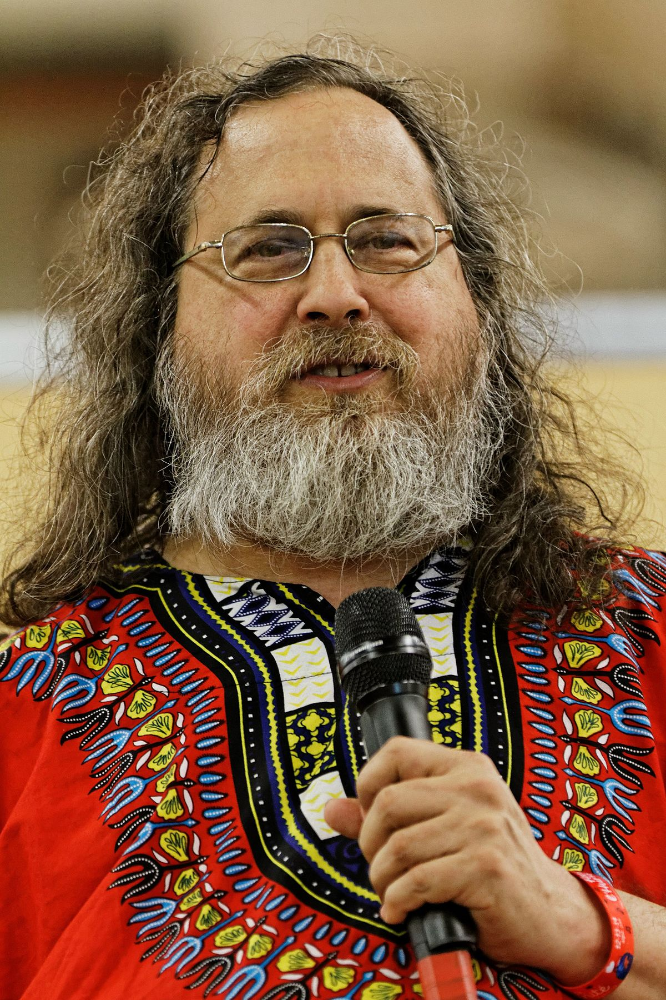
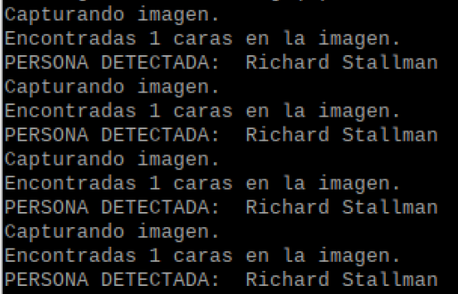
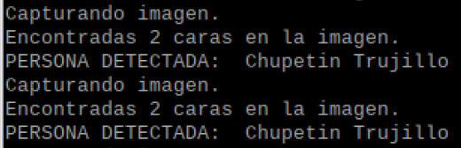
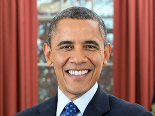
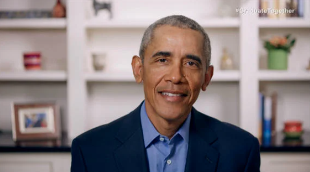
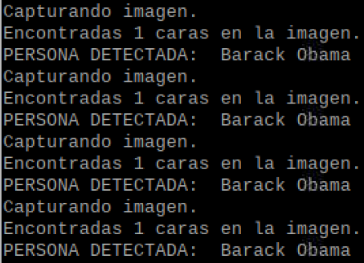

# Reconocer personas
## Instalación
```
$ pip3 install opencv-python 
$ pip3 install face-recognition
$ pip3 install picamera 
```
## Ejecución
1. Ejecutamos
	```
	$ python codigo.py
	```
2. Enfocamos la cámara en la cara de la persona o foto
## Pruebas:
1. Richard Stallman
	1. Imagen modelo  
		
	2. Imagen enfocada con la cámara   
		
	3. Output  
		
2. Chupetin Trujillo
	1. Imagen modelo  
		
	2. Imagen enfocada con la cámara  
		
	3. Output  
		
3. Barack Obama
	1. Imagen modelo  
		
	2. Imagen enfocada con la cámara  
		
	3. Output  
		
